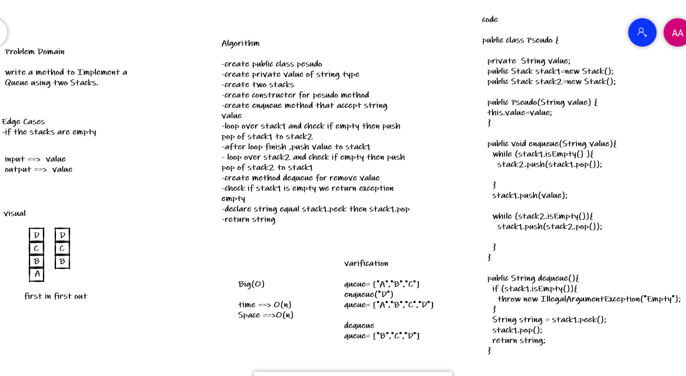

# Challenge Summary

create a PseudoQueue class which have two Stack instances as fields, and two methods : enqueue , dequeue.

## Whiteboard Process

## Approach & Efficiency

time :O(n)
space : O(n)