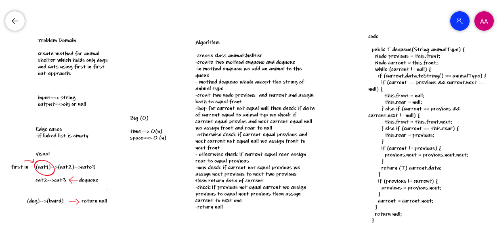

# Challenge Summary

doing a Animal Shelter that have enqueue and dequeue methods to work with cat and dogs objects

## Whiteboard Process

## Approach & Efficiency
 time : O(n) scape : O(n)

[code link](../img/ch12.PNG)