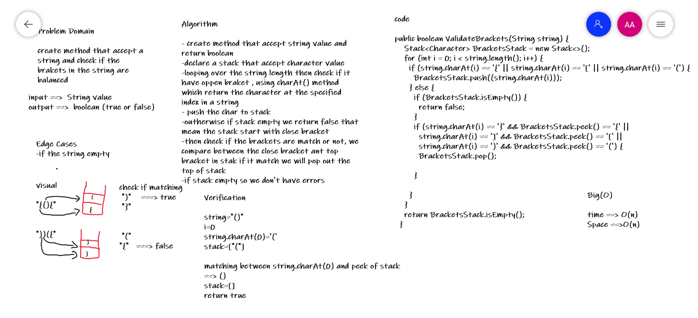

# Challenge Summary

Write a function called validate brackets takes a String as an Arguments representing whether or not the brackets in the string are balanced, There are 3 types of brackets:

Round Brackets : ()

Square Brackets : []

Curly Brackets : {}

## Whiteboard Process

## Approach & Efficiency

time :O(n)
space : O(n)