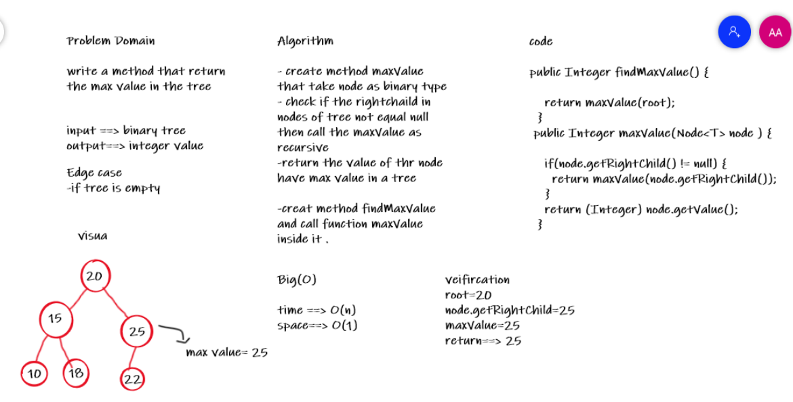

# Challenge Summary

Add method to return the max value inside the tree

## Whiteboard Process

## Approach & Efficiency

the approach that I've used in this challenge the recursion function With complexity : time > O(n) , space > O(1)
