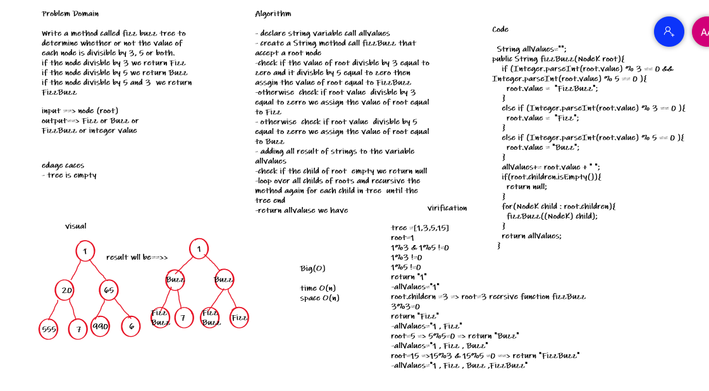

# Challenge Summary

Write a method called fizz buzz tree to determine whether or not the value of each node is divisible by 3, 5 or both.
if the node divisble by 3 we return Fizz
if the node divisble by 5 we return Buzz
if the node divisble by 5 and 3  we return FizzBuzz

## Whiteboard Process

## Approach & Efficiency

the approach that I've used in this challenge the foreach loop With complexity : time > O(n) , space > O(n)

[CODE_LINK](https://github.com/abrar189/data-structures-and-algorithms1/blob/tree-fizz-buzz/java/tree/app/src/main/java/tree/KTree.java)