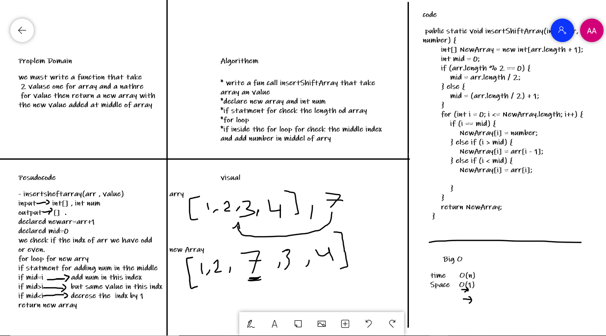

# Insert to Middle of an Array

 we must write a function that take2 valuse one for array and the athore
 for value then return a new array with the new value added at middle of array
 I found this challenge hard alittle bit

## Whiteboard Process

## Approach & Efficiency

first I started from whiteboard ,determain proplem domain then do pesudocode ,algorithem then start doing my code .this challenge take about 2 hr.