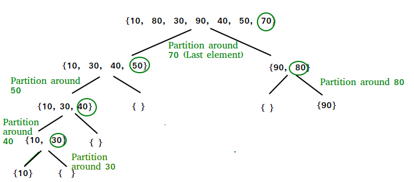
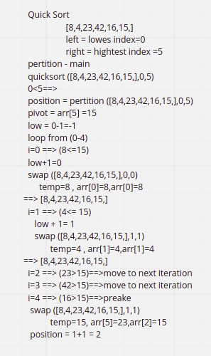
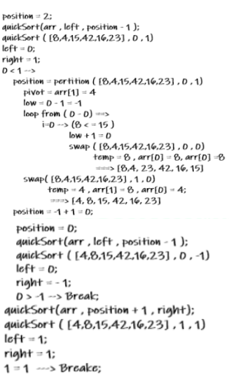

# QuickSort

## QuickSort is a Divide and Conquer algorithm.
It picks an element as pivot and partitions the given array around the picked pivot.
There are many different versions of quickSort that pick pivot in different ways.

- Always pick first element as pivot.
- Always pick last element as pivot (implemented below)
- Pick a random element as pivot.
- Pick median as pivot.

## Pseudocode

ALGORITHM QuickSort(arr, left, right)
if left < right
// Partition the array by setting the position of the pivot value
DEFINE position <-- Partition(arr, left, right)
// Sort the left
QuickSort(arr, left, position - 1)
// Sort the right
QuickSort(arr, position + 1, right)

ALGORITHM Partition(arr, left, right)
// set a pivot value as a point of reference
DEFINE pivot <-- arr[right]
// create a variable to track the largest index of numbers lower than the defined pivot
DEFINE low <-- left - 1
for i <- left to right do
if arr[i] <= pivot
low++
Swap(arr, i, low)

     // place the value of the pivot location in the middle.
     // all numbers smaller than the pivot are on the left, larger on the right.
     Swap(arr, right, low + 1)
    // return the pivot index point
     return low + 1

ALGORITHM Swap(arr, i, low)
DEFINE temp;
temp <-- arr[i]
arr[i] <-- arr[low]
arr[low] <-- temp

## Trace

Sample Array: [8,4,23,42,16,15]

- Pass 1:

while the length of the array is greater than 0 will call pertition method to find position value.

- Pass2 :

will call the quick sort method using position and left value, call the pertition and find the new position, then call quick sort first with position and left value, then with position and right value.

quick sort for left -main

p=2, L=0, R =1

pertition =0

Quick sort for left p=0//L=0//R=-1

Quick sort for Right p=0//L=0//R=1

-Pass 3:

will call the quick sort method using position and right value, call the pertition and find the new position, then call quick sort first with position and left value, then with position and right value.

we will get the sorted array, return it.

## Efficency

- Time: log(n):

The best case occurs when the partition process always picks the middle element as pivot.

- Space: O(1):

No additional space is being created.
