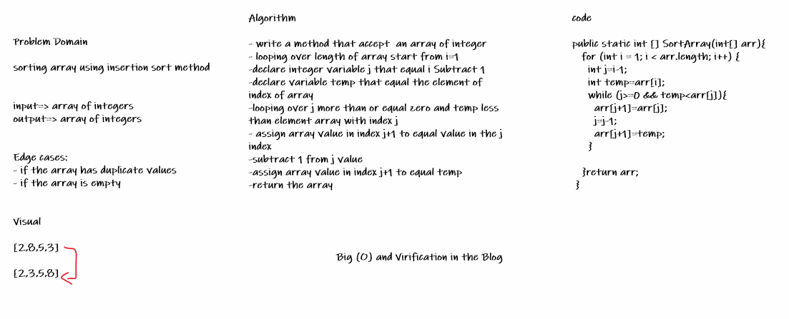

# Challenge 26

- Sorting array using Insertion Sort algorithm.
- Document explanation by creating a blog article that shows the step-by-step output after each iteration through some sort of visual.
- testing implementation of Insertion Sort based on the pseudocode provided.

## Whiteboard Process

## Approach & Efficiency

for and while loop:

Time: O(n^2):

Space: O(1):

[Blog of challenge](https://github.com/abrar189/data-structures-and-algorithms1/blob/challenge26/java/challenge26/Blog.md)

# Challenge 27

- Sorting array using Merge Sort algorithm.
- Document explanation by creating a blog article that shows the step-by-step output after each iteration - through some sort of visual.
- testing implementation of Merge Sort based on the pseudocode provided.

## Whiteboard Process

## Approach & Efficiency

for and while loop:

Time: nlog(n)

Space: O(n)

[Blog of challenge](https://github.com/abrar189/data-structures-and-algorithms1/blob/challenge26/java/challenge26/Blog.md)
