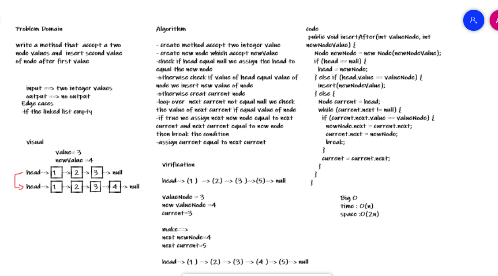

# Challenge Summary

append(int): adds a new node with the given value to the end of the list

## Whiteboard Process

## Approach & Efficiency

time :O(n)
space : O(2n)

# Challenge Summary

insertAfter(int , int) method to add a new node with the given new value immediately after the first node that has the value specified

## Whiteboard Process

## Approach & Efficiency

time :O(n)
space : O(2n)

# Challenge Summary

insertBefore(int, int) method to add a new node with the given new value immediately before the first node that has the value specified.

## Whiteboard Process

## Approach & Efficiency

time :O(n)
space : O(2n)
