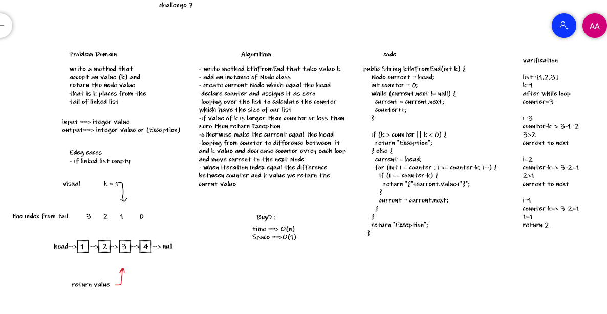

# Challenge Summary
kthFromEnd(int) write a method that Return the node’s value that is k (given number) places from the tail of the linked list.

## Whiteboard Process

## Approach & Efficiency
 time : O(n) scape : O(1)

