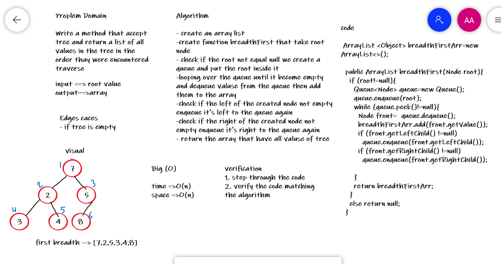

# Challenge Summary

Add method to the tree to handle the breadth first traverse level by level

## Whiteboard Process

## Approach & Efficiency

the approach that I've used in this challenge the while loop With complexity : time > O(n) , space > O(n)

[CODE_LINK](https://github.com/abrar189/data-structures-and-algorithms1/blob/tree-breadth-first/java/tree/app/src/main/java/tree/BinaryTree.java)