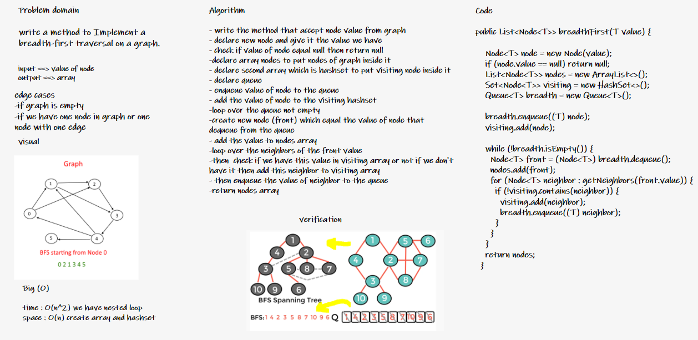
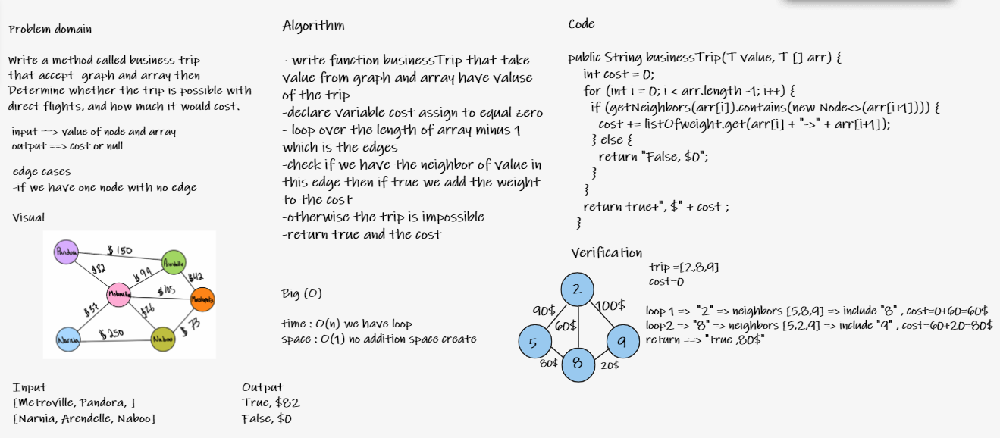

# Graphs
A graph is a non-linear data structure that can be looked at as a collection of vertices (or nodes) potentially connected by line segments named edges.

## Here is some common terminology used when working with Graphs:

- Vertex - A vertex, also called a “node”, is a data object that can have zero or more adjacent vertices.
- Edge - An edge is a connection between two nodes.
- Neighbor - The neighbors of a node are its adjacent nodes, i.e., are connected via an edge.
- Degree - The degree of a vertex is the number of edges connected to that vertex.

## Challenge

- Create a addNode method which has a data property.
- Create a addEdge method that has properties for Two String Value1 , Value2 .
- Create a getNodes method which set Key.
- Create a getNighbors method that Take String Data which Return List .
- Create a size method that return Size .

## Approach & Efficiency

 Big O :
 - space of O(n)
 - time of O(1)

## API

### add node
- Arguments: value
- Returns: The added node
- Add a node to the graph

### add edge
- Arguments: 2 nodes to be connected by the edge, weight (optional)
- Returns: nothing
- Adds a new edge between two nodes in the graph If specified, assign a weight to the edge Both nodes should already be in the Graph

### get nodes
- Arguments: none
- Returns all of the nodes in the graph as a collection (set, list, or similar)

### get neighbors
- Arguments: node
- Returns a collection of edges connected to the given node Include the weight of the connection in the returned collection

### size
- Arguments: none
- Returns the total number of nodes in the graph

[link of code](https://github.com/abrar189/data-structures-and-algorithms1/tree/graph/java/graph)

## challenge 36 :

### Challenge Summary

write a method to traverse a graph using breadth-first
- input -> Node
- output -> A collection of nodes in the order they were visited.

### Whiteboard Process

### Approach & Efficiency

- time : O(n^2) - nested loop
- scape : O(n) - create new list and Set.

[link of code](https://github.com/abrar189/data-structures-and-algorithms1/tree/graph-breadth-first/java/graph/app/src)

## challenge 37 :

### Challenge Summary

Write a function called business trip, and Determine whether the trip is possible with direct flights, and how much it would cost.

- Arguments: graph, array of city names
- Return: cost or null

### Whiteboard Process

### Approach & Efficiency

- time : O(n) we have loop
- pace : O(1) no addition space create

[link of code](https://github.com/abrar189/data-structures-and-algorithms1/tree/graph-business-trip/java/graph/app/src)

